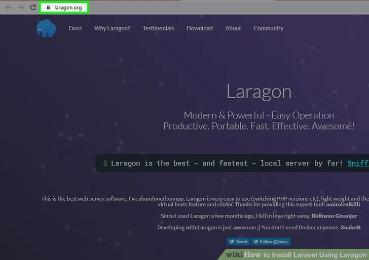
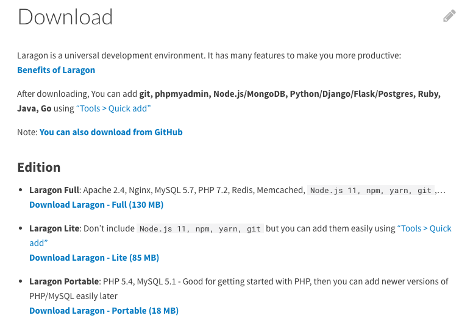

Solusi dari Kelompok 24 bernama BEBAS adalah sebuah web yang beranama Cent

Dengan anggota dan pembagian tugasnya adalah sebagai berikut:

 Kelompok 10 Buddies 1 

	
 1. Nicholas Darmawan 16519009 - Front end 

	
 2. Reihan Andika Putra 16519316 - Back end 

	
 3. Kadek Dwi Bagus AU 16519350 - Back end 

	
 4. Karel Renaldi 16519445 - Front end 

	
 5. James Chandra 16519446 - Front end 

	
 6. Muhammad Galih R R 16519455 - Front end 

	
 Kelompok 8 Buddies 4 

	
 1. Haning Nanda H 16519004 - Penjelasan 

	
 2. M Reyhanullah B 165199306 - Penjelasan 

	
 3. Muhammad Iqbal S 16519349 - Penjelasan

	
 4. Cindy Amandani N 165199410 - Penjelasan

	
 5. Ilyasa Salafi Putra J 16519457 - Penjelasan

	
 6. Muhammad Asyrofi Al H 16519494

Cent adalah sebuah web yang membantu agar penggunanya dapat mengatur keuangan secara proporsional sehingga uang dapat digunakan dengan baik.

## Instalasi Tools Untuk Laravel

Sebelum kamu dapat melanjutkan tahap Laravel, kamu dapat memasang tools di bawah ini sesuai dengan sistem operasi yang kamu gunakan

Windows

Untuk sistem operasi Windows, tools yang direkomendasikan untuk membuat aplikasi PHP dan Laravel adalah Laragon. Pada laragon, kamu juga dapat memasang aplikasi tanpa harus melakukan instalasi lewat command line
1. Masuk ke website laragon.org lalu klik Download

2. Pilih Laragon - Full

